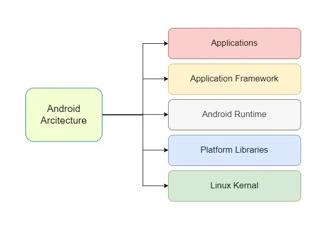
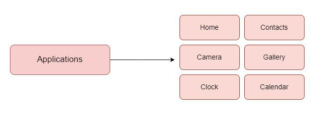
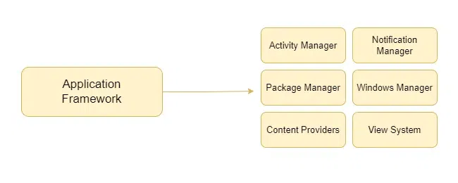
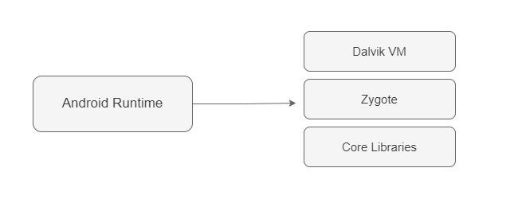
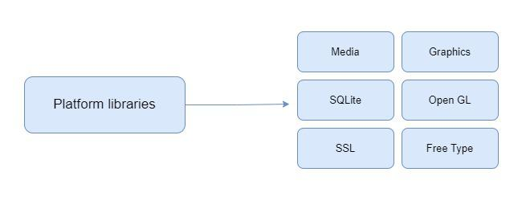
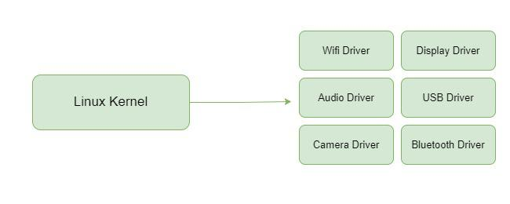

 
Android architecture contains a different number of components to support any Android device's needs. Android software contains an open-source Linux Kernel having a collection of a number of C/C++ libraries which are exposed through application framework services. Among all the components Linux Kernel provides the main functionality of operating system functions to smartphones and Dalvik Virtual Machine (DVM) provide a platform for running an Android application.

## Components of Android Architecture
The main components of Android architecture are the following:-

<ol>
<li>Applications</li>
<li>Application Framework</li>
<li>Android Runtime</li>
<li>Platform Libraries</li>
<li>Linux Kernel</li>
</ol>

Pictorial representation of Android architecture with several main components and their sub-components

Understanding Android's architecture is essential for building efficient applications. For those looking to master this structure and move from beginner to advanced skills in Kotlin, the Android Mastery with Kotlin: Beginner to Advanced course offers a comprehensive guide

# 1. Applications
Applications is the top layer of android architecture. The pre-installed applications like home, contacts, camera, gallery etc and third party applications downloaded from the play store like chat applications, games etc. will be installed on this layer only. It runs within the Android run time with the help of the classes and services provided by the application framework.

# 2. Application framework
The Application Framework is a core part of Android that gives developers the tools and services they need to build apps. It provides access to device features like hardware, screen display, and system resources. It includes several important services that make it easier to build powerful and consistent Android apps without having to create everything from scratch. The services are as follows:

Activity Manager - Manages the app’s activities and their life cycle (like opening, pausing, or closing screens).
Notification Manager - Allows apps to show alerts or updates to the user.
Package Manager - Keeps track of all the apps installed on the device.

# 3. Application runtime
Android Runtime environment is one of the most important part of Android. It contains components like core libraries and the Dalvik virtual machine(DVM). Mainly, it provides the base for the application framework and powers our application with the help of the core libraries. Like Java Virtual Machine (JVM), Dalvik Virtual Machine (DVM) is a register-based virtual machine and specially designed and optimized for android to ensure that a device can run multiple instances efficiently. It depends on the layer Linux kernel for threading and low-level memory management. The core libraries enable us to implement android applications using the standard JAVA or Kotlin programming languages.

# 4. Platform libraries
The Platform Libraries includes various C/C++ core libraries and Java based libraries such as Media, Graphics, Surface Manager, OpenGL etc. to provide a support for android development.

<b>Media </b>library provides support to play and record an audio and video formats.
<b>Surface manager</b> responsible for managing access to the display subsystem.
<b>SGL</b> and <b>OpenGL </b>both cross-language, cross-platform application program interface (API) are used for 2D and 3D computer graphics.
SQLite provides database support and FreeType provides font support.
Web-Kit This open source web browser engine provides all the functionality to display web content and to simplify page loading.
SSL (Secure Sockets Layer) is security technology to establish an encrypted link between a web server and a web browser.
Window Manager - Handles the placement and appearance of windows on the screen.
Content Providers - Help apps share data with other apps (like contacts or photos).
View System - Controls how things (like buttons or text) appear on the scree.

# 5. Linux Kernel
Linux Kernel is heart of the android architecture. It manages all the available drivers such as display drivers, camera drivers, Bluetooth drivers, audio drivers, memory drivers, etc. which are required during the runtime. The Linux Kernel will provide an abstraction layer between the device hardware and the other components of android architecture. It is responsible for management of memory, power, devices etc. The features of Linux kernel are:

Security: The Linux kernel handles the security between the application and the system.
Memory Management: It efficiently handles the memory management thereby providing the freedom to develop our apps.
Process Management: It manages the process well, allocates resources to processes whenever they need them.
Network Stack: It effectively handles the network communication.
Driver Model: It ensures that the application works properly on the device and hardware manufacturers responsible for building their drivers into the Linux build.

Other Commonly Used Architectures in Android
There are few commonly used Android Architectures used mentioned below:

## 1. MVC ( Model View Controller )
MVC or Model View Controller breaks the model into three main components Model that stores the application data , View UI layer that holds the component visible on the screen and Controller that establishes the relationship between Model and the View.

## 2. MVP ( Model View Presenter )
To avoid complexities like maintainability, readability, scalability, and refactoring of applications we use MVP model. The basic working of this model relies of the points mentioned below:

Communication between the View-Presenter and Presenter-Model happens with the help of Interface (also called Contract).
There is One to One relationship between Presenter and View , One Presenter Class only manages One View at a time.
Model and View doesn't have any knowledge about each other.
## 3. MVVM ( Model View ViewModel ) :
MVVM or Model View ViewModel as the name suggest like MVC model it contains three components too Model , View and ViewModel. Features of MVVM model are mentioned below:
<ol>
<li>ViewModel does not hold any kind of reference to the View.</li>
<li>Many to-1 relationships exist between View and ViewModel.</li>
<li>No triggering methods to update the View.</li>
</ol>
And we can achieve this using 2 methods:
<ol>
<li>Using DataBinding library of Google.</li>
<li>Using Tools like RxJava for Data Binding.</li>
</ol>

# Benefits of Architecture
Using Architecture solves many problems for us few of them are:
<ol>
<li>Improves the Maintainability , quality and robustness of the application</li>
<li>Scalability of the Application is increased using Architecuture as , users and developers bot the engamenents on the application can be increased.</li>
<li>Testing of Application gets easy because of it.</li>
<li>Bugs can be identified and removed easily with the well defined process.</li>
</ol>
