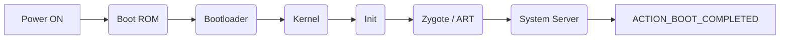

# Android Boot Process

> Clear, simple README explaining Android boot steps, design diagram, and how to use this repo.

---

## Overview

This document explains the Android boot process in simple words. It covers each step from power ON to system ready, explains what runs and why, and includes a simple diagram and suggested repo structure for a GitHub upload.

Keep the language simple so beginners can understand.

---

## Boot Steps (short summary)

1. **Boot ROM (Power ON)**

   * The device power turns on and Boot ROM code runs from a fixed location in ROM.
   * Boot ROM loads the bootloader into RAM and starts it.

2. **BootLoader**

   * Low-level code that prepares hardware and finds the kernel.
   * Runs in two stages:

     * Stage 1: Detect memory and load the stage-2 helper.
     * Stage 2: Initialize memory, network, and load the Kernel.

3. **Kernel**

   * The Linux kernel sets up memory, drivers, process table, and mounts root filesystem.
   * Kernel looks for the `init` process and starts it.

4. **Init**

   * The first user-space process (PID 1).
   * Mounts virtual filesystems like `/sys`, `/proc`, `/dev` and runs `init.rc` scripts.
   * Starts native services.

5. **Zygote and Dalvik/ART VM**

   * Zygote starts and preloads core Java classes and resources.
   * When an app launches, Zygote forks to create a new app process quickly.

6. **System Server**

   * System Server starts many Android services (ActivityManager, PackageManager, WindowManager, etc.).
   * When services are ready the system sends the `ACTION_BOOT_COMPLETED` broadcast.

---

## Detailed Design (for README)

### Goals

* Explain each boot stage clearly.
* Provide a visual flow for learning and presentations.
* Provide a repo layout so code, diagrams, and notes are organized.

### Visual Diagram (Mermaid)



> Note: GitHub supports Mermaid diagrams in Markdown. If your GitHub repo does not render it, add an image version in `/docs/`.

---

## Suggested Repository Structure

```
android-boot-process/
├─ README.md
├─ docs/
│  ├─ diagram.png        # optional image version of the diagram
│  └─ slides/            # optional presentation files
├─ notes/
│  └─ boot-details.md    # extra explanations and links
└─ LICENSE
```

---

## How to use this README

* Copy this `README.md` to the root of your GitHub repo.
* Add `docs/diagram.png` if you want an image that always renders on GitHub (some views don't render Mermaid).
* Add slides or PDFs to `docs/slides` if you plan to present.

---

## Short Explanations (one-line) for each term

* **Boot ROM:** First code that runs on power ON.
* **Bootloader:** Loads kernel and prepares hardware.
* **Kernel:** Core OS; handles drivers and system setup.
* **Init:** First user process that starts system services.
* **Zygote:** Java VM launcher that speeds up app start.
* **System Server:** Starts Android system services.

---

## License

Choose a license (for example MIT) and add a `LICENSE` file.

---

## Contributing

If you want to improve this README or add diagrams, open a PR. Keep explanations simple and add references for advanced reading.

---

## References & Further Reading

* Android source docs
* Linux boot process
* Android developer guides

*Generated README template - edit as you like before uploading to GitHub.*
