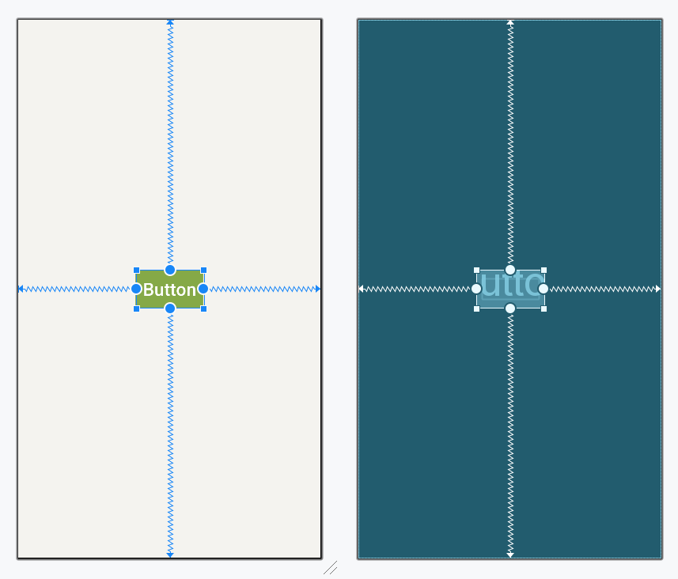
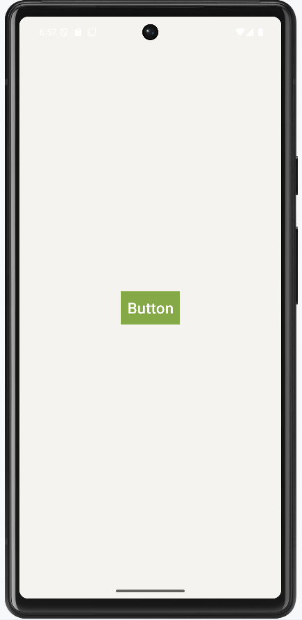
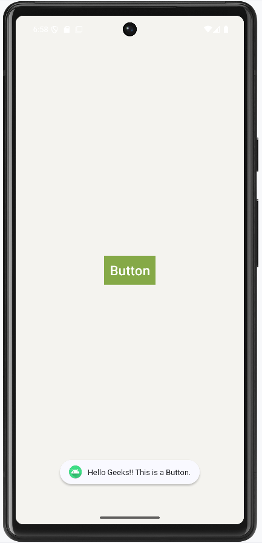

## What is Button
A Button is a user interface that is used to perform some action when clicked or tapped. It is a very common widget in Android and developers often use it. This article demonstrates how to create a button in Android Studio.

## Class Hierarchy of the Button Class in Kotlin
kotlin.Any
```
 ↳ android.view.View
   ↳ android.widgets.TextView
     ↳ android.widget.Button
```
## XML Attributes of Button Widget
| Attribute            | Description                                                   |
|----------------------|---------------------------------------------------------------|
| android:id           | Used to specify the unique ID of the view.                   |
| android:text         | Sets the text displayed on the button.                      |
| android:textColor    | Sets the color of the button text.                          |
| android:textSize     | Defines the size of the button text.                        |
| android:textStyle    | Used to style text (e.g., Bold, Italic).                    |
| android:textAllCaps  | Displays text in all capital letters when set to true.      |
| android:background   | Sets the background of the button.                          |
| android:padding      | Adds inner spacing inside the button.                       |
| android:visibility   | Controls visibility (visible, invisible, gone).             |
| android:gravity      | Sets text position inside the button (center, top, bottom). |


## Step by Step Implementation of Button in Android
In this example step by step demonstration of creating a Button will be covered. The application will consist of a button that displays a toast message when the user taps on it.

## Step 1: Create a new project
<li>Click on File, then New => New Project.</li>
<li>Choose “Empty Activity” for the project template.</li>
<li>Select language as Kotlin.</li>
<li>Select the minimum SDK as per your need.</li>

## Step 2: Modify the activity_main.xml file
Add a button widget in the layout of the activity. Below is the code of the activity_main.xml file which does the same.

activity_main.xml:  

```xml
<?xml version="1.0" encoding="utf-8"?>
<androidx.constraintlayout.widget.ConstraintLayout
    xmlns:android="http://schemas.android.com/apk/res/android"
    xmlns:app="http://schemas.android.com/apk/res-auto"
    xmlns:tools="http://schemas.android.com/tools"
    android:layout_width="match_parent"
    android:layout_height="match_parent"
    android:background="#168BC34A"
    tools:context=".MainActivity">

    <!-- Button added in the activity -->
    <Button
        android:id="@+id/button"
        android:layout_width="wrap_content"
        android:layout_height="wrap_content"
        android:background="#4CAF50"
        android:paddingStart="10dp"
        android:paddingEnd="10dp"
        android:text="Button"
        android:textSize="24sp"
        app:layout_constraintBottom_toBottomOf="parent"
        app:layout_constraintEnd_toEndOf="parent"
        app:layout_constraintStart_toStartOf="parent"
        app:layout_constraintTop_toTopOf="parent" />

</androidx.constraintlayout.widget.ConstraintLayout>
```
Layout:



## Step 3: Accessing the button in the MainActivity file
Add functionality of button in the MainActivity file. Here describe the operation to display a Toast message when the user taps on the button. Below is the code to carry out this task. 
## MainActivity.java
```java
import androidx.appcompat.app.AppCompatActivity;
import android.content.Context;
import android.os.Bundle;
import android.view.View;
import android.widget.Button;
import android.widget.Toast;

public class MainActivity extends AppCompatActivity {

    @Override
    protected void onCreate( Bundle savedInstanceState ) {
        super.onCreate(savedInstanceState);
        setContentView(R.layout.activity_main);

        // storing ID of the button
        // in a variable
        Button button = (Button)findViewById(R.id.button);

        // operations to be performed
        // when user tap on the button
        if (button != null) {
            button.setOnClickListener((View.OnClickListener)(new View.OnClickListener() {
                    public final void onClick(View it) {

                    // displaying a toast message
                    Toast.makeText((Context)MainActivity.this, R.string.message, Toast.LENGTH_LONG).show();
                }
            }));
        }
    }
}
```
## MainActivity.kt
```kt
import androidx.appcompat.app.AppCompatActivity
import android.os.Bundle
import android.widget.Button
import android.widget.Toast

class MainActivity : AppCompatActivity() {

    override fun onCreate(savedInstanceState: Bundle?) {
        super.onCreate(savedInstanceState)
        setContentView(R.layout.activity_main)

        // storing ID of the button
        // in a variable
        val button = findViewById<Button>(R.id.button)

        // operations to be performed
        // when user tap on the button
        button?.setOnClickListener()
        {
            // displaying a toast message
            Toast.makeText(this@MainActivity, R.string.message, Toast.LENGTH_LONG).show() }
    }
}
```
## Output:
 &nbsp; &nbsp;
