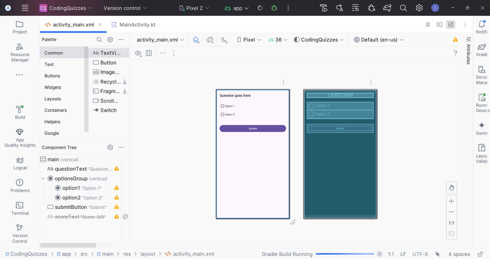

# Coding Quizzes - Android App

A simple and interactive Android application built using Java and XML that provides coding-related quizzes to help users test and improve their programming knowledge.

## 📱 Features

- 🧠 Multiple coding-related quizzes
- ✔️ Multiple-choice questions
- ⏱️ Timed quiz sessions
- 📊 Score tracking
- 🔁 Restart quizzes
- 💡 User-friendly UI

## 🛠️ Tech Stack

- **Language**: Java
- **Framework**: Android SDK
- **Layout**: XML
- **IDE**: Android Studio

## 📂 Project Structure
```
Coding-Quizzes/
├── java/
│ └── com/
│ └── quiz/
│ ├── MainActivity.java
│ ├── QuestionActivity.java
│ ├── ScoreActivity.java
│ └── model/
│ └── Question.java
└── res/
├── layout/
│ ├── activity_main.xml
│ ├── activity_question.xml
│ └── activity_score.xml
└── values/
└── strings.xml
```


## 🚀 Getting Started

1. **Clone the Repository**

```bash
git clone https://github.com/ishanwalia7579/Android-App-Project.git
cd Android-App-Project/Coding-Quizzes
```


### Open in Android Studio

* File > Open > Select the Coding-Quizzes directory

### Build & Run

* Connect an Android device or start an emulator

* Click "Run" ▶️ in Android Studio


### ✅ To-Do / Improvements
1.Add categories for different programming languages

2.Add database support for saving scores

3.Improve question randomization

4.Add explanations for answers

📸 Screenshots


Made with ❤️ by @ishanwalia7579
