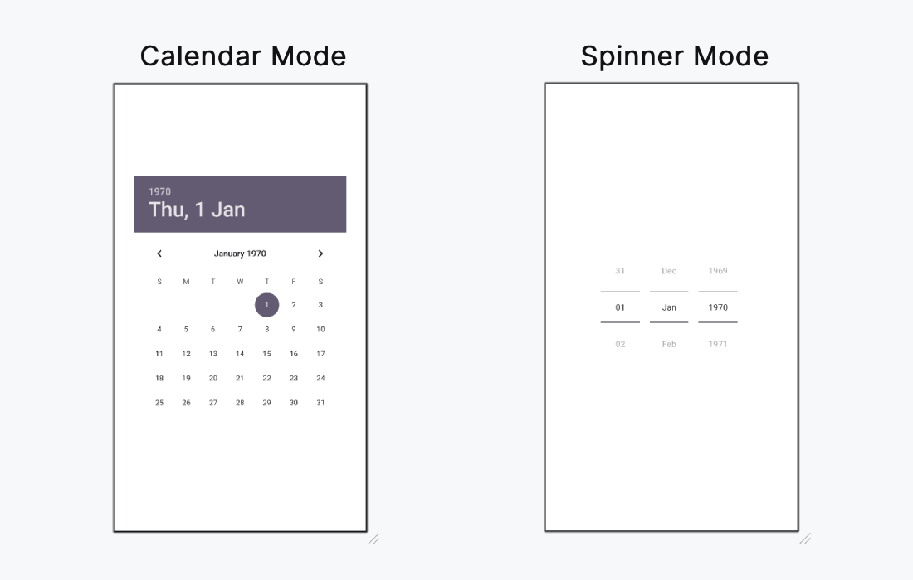

# 📆DatePicker  
<p><b>The Android DatePicker is a user interface component that allows users to select a date, including the day, month, and year. This control helps ensure that users select valid dates in an application. DatePicker offers two display modes:</b></p>
<ol type="1">
<li><b>Calendar View:</b> Displays a complete calendar for date selection.</li>
<li><b>Spinner View:</b> Displays selectable values for day, month, and year in a scrollable spinner format.</li>
</ol>
You can implement DatePicker in two ways:
<ol type="1">
<li><b>XML Layout:</b> Define the DatePicker control directly in the layout file.</li>
<li><b>Programmatically:</b> Dynamically create and configure the DatePicker in an activity file.</li>
This flexibility makes DatePicker a versatile and user-friendly solution for date input in Android applications.

## 🔹 Important XML Attributes

| Attribute                   | Description |
|----------------------------|-------------|
| `android:datePickerMode`   | Sets the mode (`calendar` or `spinner`) |
| `android:calendarTextColor`| Sets the color of the text |
| `android:calendarViewShown`| Shows or hides the calendar view (used with spinner mode) |

Steps of Implementing DatePicker
## Step 1: Create a new project in Android Studio
Below are the steps to be followed:

<ol type="1">
<li>Click on File, then New => New Project.</li>
<li>After that include the Kotlin support and click on next.</li>
<li>Select the minimum SDK as per convenience and click next button.</li>
<li>Then select the Empty activity => next => finish.</li>
</ol>

## Step 2: Adding DatePicker widget in Layout file
We can use android:datePickerMode to choose which the mode for the DatePicker. The possible values are "calendar" and "spinner". This article demonstrate how to implement both type of modes.

## activity_main.xml:
## 1.Calendar mode


```xml
<androidx.constraintlayout.widget.ConstraintLayout 
    xmlns:android="http://schemas.android.com/apk/res/android"
    xmlns:app="http://schemas.android.com/apk/res-auto"
    xmlns:tools="http://schemas.android.com/tools"
    android:id="@+id/main"
    android:layout_width="match_parent"
    android:layout_height="match_parent"
    android:background="@color/white"
    tools:context=".MainActivity">

    <DatePicker
        android:id="@+id/datePicker"
        android:layout_width="wrap_content"
        android:layout_height="wrap_content"
        android:datePickerMode="calendar"
        app:layout_constraintBottom_toBottomOf="parent"
        app:layout_constraintEnd_toEndOf="parent"
        app:layout_constraintStart_toStartOf="parent"
        app:layout_constraintTop_toTopOf="parent" />

</androidx.constraintlayout.widget.ConstraintLayout>
```
## 2.Spinner mode

```xml
<androidx.constraintlayout.widget.ConstraintLayout 
    xmlns:android="http://schemas.android.com/apk/res/android"
    xmlns:app="http://schemas.android.com/apk/res-auto"
    xmlns:tools="http://schemas.android.com/tools"
    android:id="@+id/main"
    android:layout_width="match_parent"
    android:layout_height="match_parent"
    android:background="@color/white"
    tools:context=".MainActivity">

    <DatePicker
        android:id="@+id/datePicker"
        android:layout_width="wrap_content"
        android:layout_height="wrap_content"
        android:calendarViewShown="false"
        android:datePickerMode="spinner"
        app:layout_constraintBottom_toBottomOf="parent"
        app:layout_constraintEnd_toEndOf="parent"
        app:layout_constraintStart_toStartOf="parent"
        app:layout_constraintTop_toTopOf="parent" />

</androidx.constraintlayout.widget.ConstraintLayout>
```
## Design UI:


# Step 3: Access the DatePicker in MainActivity.kt file
First of all, we declare a variable datePicker to access the DatePicker widget from the XML layout. 

```
val datePicker: DatePicker = findViewById(R.id.datePicker)
```
then, we declare another variable today to get the current get like this. 

```
datePicker.init(
    today.get(Calendar.YEAR),
    today.get(Calendar.MONTH),
    today.get(Calendar.DAY_OF_MONTH)
)
```

To display the selected date from the calendar we will use 

```
{ view, year, month, day ->
    val msg = "You Selected: $day/${month+1}/$year"
    Toast.makeText(this@MainActivity, msg, Toast.LENGTH_SHORT).show()
}
```
We are familiar with further activities in previous articles like accessing button and set OnClickListener etc.
# MainActivity.kt:
```kt
package org.geeksforgeeks.demo

import android.os.Bundle
import android.widget.DatePicker
import android.widget.Toast
import androidx.appcompat.app.AppCompatActivity
import java.util.Calendar

class MainActivity : AppCompatActivity() {

    override fun onCreate(savedInstanceState: Bundle?) {
        super.onCreate(savedInstanceState)
        setContentView(R.layout.activity_main)

        val datePicker: DatePicker = findViewById(R.id.datePicker)
        val today = Calendar.getInstance()
        datePicker.init(
            today.get(Calendar.YEAR),
            today.get(Calendar.MONTH),
            today.get(Calendar.DAY_OF_MONTH)
        ) { view, year, month, day ->
            val msg = "You Selected: $day/${month+1}/$year"
            Toast.makeText(this@MainActivity, msg, Toast.LENGTH_SHORT).show()
        }
    }
}

```
