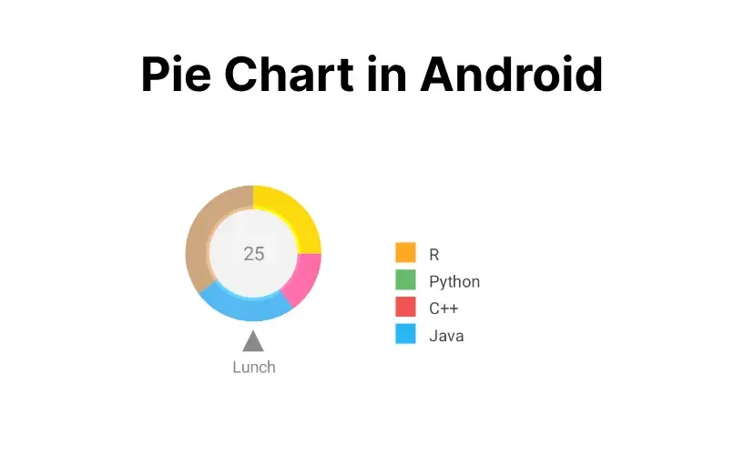
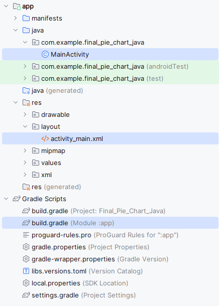

# Pie Chart into an Android Application
A Pie Chart is a circular statistical graphic, which is divided into slices to illustrate numerical proportions. It depicts a special chart that uses “pie slices”, where each sector shows the relative sizes of data. A circular chart cuts in the form of radii into segments describing relative frequencies or magnitude also known as a circle graph. A pie chart represents numbers in percentages, and the total sum of all segments needs to equal 100%.

Here is the Final Application which will be created.

## Step-by-Step Implementation of Pie Chart in Android Application
So let’s see the steps to add a Pie Chart into an Android app.

# Step 1: Opening/Creating a New Project
To create a new project in Android Studio please refer to How to Create/Start a New Project in Android Studio.

Note: Select Java/Kotlin as the programming language.

Directory Structure for the Application will seem like this after creation:


# Step 2: Before going to the Coding Section first you have to do some Pre-Task.
i). Navigate to Gradle Scripts

Add the dependencies required in the application to implement the Pie Chart.
# build.gradle (Module: app):
```build.gradle
dependencies{
     // For Card view
     implementation 'androidx.cardview:cardview:1.0.0'

     // Chart and graph library
     implementation 'com.github.blackfizz:eazegraph:1.2.2@aar'
     implementation 'com.nineoldandroids:library:2.4.0'
}
