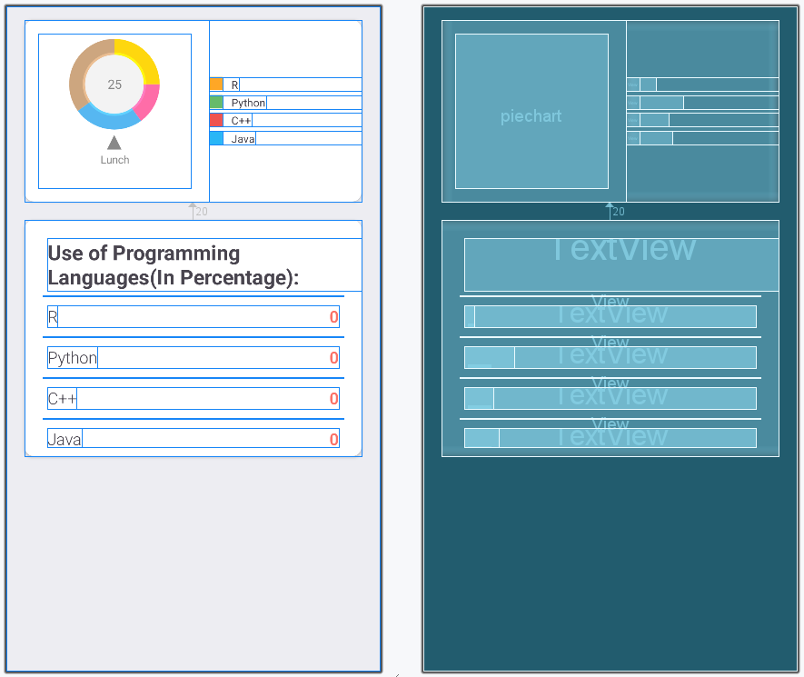

# Pie Chart into an Android Application
A Pie Chart is a circular statistical graphic, which is divided into slices to illustrate numerical proportions. It depicts a special chart that uses “pie slices”, where each sector shows the relative sizes of data. A circular chart cuts in the form of radii into segments describing relative frequencies or magnitude also known as a circle graph. A pie chart represents numbers in percentages, and the total sum of all segments needs to equal 100%.

Here is the Final Application which will be created.

## Step-by-Step Implementation of Pie Chart in Android Application
So let’s see the steps to add a Pie Chart into an Android app.

# Step 1: Opening/Creating a New Project
To create a new project in Android Studio please refer to How to Create/Start a New Project in Android Studio.

Note: Select Java/Kotlin as the programming language.

Directory Structure for the Application will seem like this after creation:


# Step 2: Before going to the Coding Section first you have to do some Pre-Task.
i). Navigate to Gradle Scripts

Add the dependencies required in the application to implement the Pie Chart.
# build.gradle (Module: app):
```build.gradle
dependencies{
     // For Card view
     implementation 'androidx.cardview:cardview:1.0.0'

     // Chart and graph library
     implementation 'com.github.blackfizz:eazegraph:1.2.2@aar'
     implementation 'com.nineoldandroids:library:2.4.0'
}
```
After Importing following dependencies and click the “sync Now” on the above pop up.

ii). Navigate to colors.xml and fill color

# colors.xml:
```xml


<?xml version="1.0" encoding="utf-8"?>
<resources>
    <color name="colorPrimary">#024265</color>
    <color name="colorPrimaryDark">#024265</color>
    <color name="colorAccent">#05af9b</color>

    <color name="color_one">#fb7268</color>
    <color name="color_white">#ededf2</color>
    <color name="color_two">#E3E0E0</color>

    <color name="R">#FFA726</color>
    <color name="Python">#66BB6A</color>
    <color name="CPP">#EF5350</color>
    <color name="Java">#29B6F6</color>

</resources>

```
# Step 3: Designing the Layout of the Application
Layout is the component which is essential to define the UI of the application , So let us edit the activity main file.

# activity_main.xml:
```xml

<?xml version="1.0" encoding="utf-8"?>
<RelativeLayout

    xmlns:android="http://schemas.android.com/apk/res/android"
    xmlns:app="http://schemas.android.com/apk/res-auto"
    xmlns:tools="http://schemas.android.com/tools"
    android:layout_width="match_parent"
    android:layout_height="match_parent"
    android:background="@color/color_white"
    tools:context=".MainActivity">

    <!-- Card view for displaying the -->
    <!-- Pie chart and details of pie chart -->
    <androidx.cardview.widget.CardView
        android:id="@+id/cardViewGraph"
        android:layout_width="match_parent"
        android:layout_height="200dp"
        android:layout_marginLeft="20dp"
        android:layout_marginRight="20dp"
        android:layout_marginTop="15dp"
        android:elevation="10dp"
        app:cardCornerRadius="10dp">


        <!--Linear layout to display pie chart -->
        <!-- and details of pie chart-->

        <LinearLayout
            android:layout_width="match_parent"
            android:layout_height="match_parent"
            android:orientation="horizontal"
            android:weightSum="2">

            <!--Pie chart to display the data-->

            <org.eazegraph.lib.charts.PieChart
                xmlns:app="http://schemas.android.com/apk/res-auto"
                android:id="@+id/piechart"
                android:layout_width="0dp"
                android:layout_height="match_parent"
                android:padding="6dp"
                android:layout_weight="1"
                android:layout_marginTop="15dp"
                android:layout_marginLeft="15dp"
                android:layout_marginBottom="15dp"

                />

            <!--Creating another linear layout -->
            <!-- to display pie chart details -->
            <LinearLayout
                android:layout_width="0dp"
                android:layout_height="match_parent"
                android:layout_weight="1"
                android:layout_marginLeft="20dp"
                android:orientation="vertical"
                android:gravity="center_vertical"
                >

                <LinearLayout
                    android:layout_width="match_parent"
                    android:layout_height="15dp"
                    android:layout_gravity="center_vertical">

                    <!--View to display the yellow color icon-->
                    <View
                        android:layout_width="15dp"
                        android:layout_height="match_parent"
                        android:background="@color/R"/>

                    <!--Text view to display R -->
                    <TextView
                        android:layout_width="wrap_content"
                        android:layout_height="wrap_content"
                        android:text="R"
                        android:paddingLeft="10dp"/>

                </LinearLayout>

                <!--Linear layout to display Python-->
                <LinearLayout
                    android:layout_width="match_parent"
                    android:layout_height="15dp"
                    android:layout_gravity="center_vertical"
                    android:layout_marginTop="5dp">

                    <!--View to display the green color icon-->
                    <View
                        android:layout_width="15dp"
                        android:layout_height="match_parent"
                        android:background="@color/Python"/>

                    <!--Text view to display python text -->
                    <TextView
                        android:layout_width="wrap_content"
                        android:layout_height="wrap_content"
                        android:text="Python"
                        android:paddingLeft="10dp"/>

                </LinearLayout>

                <!--Linear layout to display C++-->
                <LinearLayout
                    android:layout_width="match_parent"
                    android:layout_height="15dp"
                    android:layout_gravity="center_vertical"
                    android:layout_marginTop="5dp">

                    <!--View to display the red color icon-->
                    <View
                        android:layout_width="15dp"
                        android:layout_height="match_parent"
                        android:background="@color/CPP"/>

                    <!--Text view to display C++ text -->
                    <TextView
                        android:layout_width="wrap_content"
                        android:layout_height="wrap_content"
                        android:text="C++"
                        android:paddingLeft="10dp"/>

                </LinearLayout>

                <!--Linear layout to display Java-->
                <LinearLayout
                    android:layout_width="match_parent"
                    android:layout_height="15dp"
                    android:layout_gravity="center_vertical"
                    android:layout_marginTop="5dp">

                    <!--View to display the blue color icon-->
                    <View
                        android:layout_width="15dp"
                        android:layout_height="match_parent"
                        android:background="@color/Java"/>

                    <!--Text view to display Java text -->
                    <TextView
                        android:layout_width="wrap_content"
                        android:layout_height="wrap_content"
                        android:text="Java"
                        android:paddingLeft="10dp"/>

                </LinearLayout>

            </LinearLayout>

        </LinearLayout>

    </androidx.cardview.widget.CardView>


    <!-- Another Card view for displaying -->
    <!-- Use of programming languages -->
    <androidx.cardview.widget.CardView
        android:layout_width="match_parent"
        android:layout_height="260dp"
        android:layout_below="@+id/cardViewGraph"
        android:layout_marginLeft="20dp"
        android:layout_marginRight="20dp"
        android:layout_marginTop="20dp"
        android:layout_marginBottom="20dp"
        android:elevation="10dp"
        app:cardCornerRadius="10dp"
        android:id="@+id/details">

        <!--Relative layout to display -->
        <!-- use of programming languages -->
        <LinearLayout
            android:layout_width="match_parent"
            android:layout_height="wrap_content"
            android:orientation="vertical">

            <!--Text view to use of -->
            <!-- programming languages text-->
            <TextView
                android:layout_width="match_parent"
                android:layout_height="wrap_content"
                android:text="Use of Programming Languages(In Percentage):"
                android:textSize="23sp"
                android:textStyle="bold"
                android:layout_marginLeft="25dp"
                android:layout_marginTop="20dp"/>

            <!--View to display the line-->
            <View
                android:layout_width="match_parent"
                android:layout_height="1dp"
                android:background="@color/color_two"
                android:layout_marginLeft="20dp"
                android:layout_marginRight="20dp"
                android:layout_marginTop="5dp"/>

            <RelativeLayout
                android:layout_width="match_parent"
                android:layout_height="wrap_content"
                android:layout_marginRight="25dp"
                android:layout_marginLeft="25dp"
                android:layout_marginTop="10dp"
                android:layout_marginBottom="10dp">

                <!--Text view to display R -->
                <TextView
                    android:layout_width="wrap_content"
                    android:layout_height="wrap_content"
                    android:fontFamily="sans-serif-light"
                    android:text="R"
                    android:textSize="18sp"/>

                <!--Text view to display the -->
                <!-- percentage of programming language -->
                <!-- used. For now default set to 0-->
                <TextView
                    android:layout_width="fill_parent"
                    android:layout_height="wrap_content"
                    android:text="0"
                    android:id="@+id/tvR"
                    android:textAlignment="textEnd"
                    android:textSize="18sp"
                    android:textColor="@color/color_one"
                    android:textStyle="bold"
                    android:fontFamily="sans-serif-light"
                    android:layout_alignParentRight="true"/>
            </RelativeLayout>

            <!--View to display the line-->
            <View
                android:layout_width="match_parent"
                android:layout_height="1dp"
                android:background="@color/color_two"
                android:layout_marginLeft="20dp"
                android:layout_marginRight="20dp" />

            <RelativeLayout
                android:layout_width="match_parent"
                android:layout_height="wrap_content"
                android:layout_marginRight="25dp"
                android:layout_marginLeft="25dp"
                android:layout_marginTop="10dp"
                android:layout_marginBottom="10dp">

                <TextView
                    android:layout_width="wrap_content"
                    android:layout_height="wrap_content"
                    android:fontFamily="sans-serif-light"
                    android:text="Python"
                    android:textSize="18sp"/>

                <!--Text view to display the percentage -->
                <!-- of programming language used. -->
                <!-- For now default set to 0-->

                <TextView
                    android:layout_width="fill_parent"
                    android:layout_height="wrap_content"
                    android:text="0"
                    android:id="@+id/tvPython"
                    android:textAlignment="textEnd"
                    android:textSize="18sp"
                    android:textColor="@color/color_one"
                    android:textStyle="bold"
                    android:fontFamily="sans-serif-light"
                    android:layout_alignParentRight="true"/>

            </RelativeLayout>
            <View
                android:layout_width="match_parent"
                android:layout_height="1dp"
                android:background="@color/color_two"
                android:layout_marginLeft="20dp"
                android:layout_marginRight="20dp" />

            <RelativeLayout
                android:layout_width="match_parent"
                android:layout_height="wrap_content"
                android:layout_marginRight="25dp"
                android:layout_marginLeft="25dp"
                android:layout_marginTop="10dp"
                android:layout_marginBottom="10dp">

                <TextView
                    android:layout_width="wrap_content"
                    android:layout_height="wrap_content"
                    android:fontFamily="sans-serif-light"
                    android:text="C++"
                    android:textSize="18sp"/>

                <!--Text view to display the percentage -->
                <!-- of programming language used. -->
                <!-- For now default set to 0-->
                <TextView
                    android:layout_width="fill_parent"
                    android:layout_height="wrap_content"
                    android:text="0"
                    android:id="@+id/tvCPP"
                    android:textAlignment="textEnd"
                    android:textSize="18sp"
                    android:textColor="@color/color_one"
                    android:textStyle="bold"
                    android:fontFamily="sans-serif-light"
                    android:layout_alignParentRight="true"/>

            </RelativeLayout>
            <View
                android:layout_width="match_parent"
                android:layout_height="1dp"
                android:background="@color/color_two"
                android:layout_marginLeft="20dp"
                android:layout_marginRight="20dp" />

            <RelativeLayout
                android:layout_width="match_parent"
                android:layout_height="wrap_content"
                android:layout_marginRight="25dp"
                android:layout_marginLeft="25dp"
                android:layout_marginTop="10dp"
                android:layout_marginBottom="10dp">

                <TextView
                    android:layout_width="wrap_content"
                    android:layout_height="wrap_content"
                    android:fontFamily="sans-serif-light"
                    android:text="Java"
                    android:textSize="18sp"/>

                <!--Text view to display the percentage -->
                <!-- of programming language used. -->
                <!-- For now default set to 0-->
                <TextView
                    android:layout_width="fill_parent"
                    android:layout_height="wrap_content"
                    android:text="0"
                    android:id="@+id/tvJava"
                    android:textAlignment="textEnd"
                    android:textSize="18sp"
                    android:textColor="@color/color_one"
                    android:textStyle="bold"
                    android:fontFamily="sans-serif-light"
                    android:layout_alignParentRight="true"/>

            </RelativeLayout>
        </LinearLayout>
    </androidx.cardview.widget.CardView>
</RelativeLayout>

```


# Step 4: Add the Functionality to the Application
Now We have created a fine layout implementing the Pie Chart. So, let us add the functionality to this layout and the application by working in MainActivity File.

# MainActivity File:
```java
package com.example.final_pie_chart_java;

// Import the required libraries
import androidx.appcompat.app.AppCompatActivity;
import android.graphics.Color;
import android.os.Bundle;
import android.widget.TextView;
import org.eazegraph.lib.charts.PieChart;
import org.eazegraph.lib.models.PieModel;

public class MainActivity extends AppCompatActivity {

    // Create the object of TextView
    // and PieChart class
    TextView tvR, tvPython, tvCPP, tvJava;
    PieChart pieChart;

    @Override
    protected void onCreate(Bundle savedInstanceState)
    {
        super.onCreate(savedInstanceState);
        setContentView(R.layout.activity_main);

        // Link those objects with their
        // respective id's that
        // we have given in .XML file
        tvR = findViewById(R.id.tvR);
        tvPython = findViewById(R.id.tvPython);
        tvCPP = findViewById(R.id.tvCPP);
        tvJava = findViewById(R.id.tvJava);
        pieChart = findViewById(R.id.piechart);

        // Creating a method setData()
        // to set the text in text view and pie chart
        setData();
    }

    private void setData()
    {
        // Set the percentage of language used
        tvR.setText(Integer.toString(40));
        tvPython.setText(Integer.toString(30));
        tvCPP.setText(Integer.toString(5));
        tvJava.setText(Integer.toString(25));

        // PieModel Elements to be add created
        PieModel p1 = new PieModel("R",Integer.parseInt(tvR.getText().toString()),
                        Color.parseColor("#FFA726"));
                        
        PieModel p2 = new PieModel("Python",Integer.parseInt(tvPython.getText().toString()),
                        Color.parseColor("#66BB6A")) ;
                        
        PieModel p3 = new PieModel("C++",Integer.parseInt(tvCPP.getText().toString()),
                        Color.parseColor("#EF5350"));
                        
        PieModel p4 = new PieModel("Java",Integer.parseInt(tvJava.getText().toString()),
                        Color.parseColor("#29B6F6"));
        

        // Set the data and color to the pie chart
        pieChart.addPieSlice(p1);
        pieChart.addPieSlice(p2);
        pieChart.addPieSlice(p3);
        pieChart.addPieSlice(p4);

        // To animate the pie chart
        pieChart.startAnimation();
    }
}

```
# MainActivity File:
```kotlin

package com.example.final_pie_chart_java;

// Import the required libraries
import androidx.appcompat.app.AppCompatActivity;
import android.graphics.Color;
import android.os.Bundle;
import android.widget.TextView;
import org.eazegraph.lib.charts.PieChart;
import org.eazegraph.lib.models.PieModel;

public class MainActivity extends AppCompatActivity {

    // Create the object of TextView
    // and PieChart class
    TextView tvR, tvPython, tvCPP, tvJava;
    PieChart pieChart;

    @Override
    protected void onCreate(Bundle savedInstanceState)
    {
        super.onCreate(savedInstanceState);
        setContentView(R.layout.activity_main);

        // Link those objects with their
        // respective id's that
        // we have given in .XML file
        tvR = findViewById(R.id.tvR);
        tvPython = findViewById(R.id.tvPython);
        tvCPP = findViewById(R.id.tvCPP);
        tvJava = findViewById(R.id.tvJava);
        pieChart = findViewById(R.id.piechart);

        // Creating a method setData()
        // to set the text in text view and pie chart
        setData();
    }

    private void setData()
    {
        // Set the percentage of language used
        tvR.setText(Integer.toString(40));
        tvPython.setText(Integer.toString(30));
        tvCPP.setText(Integer.toString(5));
        tvJava.setText(Integer.toString(25));

        // PieModel Elements to be add created
        PieModel p1 = new PieModel("R",Integer.parseInt(tvR.getText().toString()),
                        Color.parseColor("#FFA726"));
                        
        PieModel p2 = new PieModel("Python",Integer.parseInt(tvPython.getText().toString()),
                        Color.parseColor("#66BB6A")) ;
                        
        PieModel p3 = new PieModel("C++",Integer.parseInt(tvCPP.getText().toString()),
                        Color.parseColor("#EF5350"));
                        
        PieModel p4 = new PieModel("Java",Integer.parseInt(tvJava.getText().toString()),
                        Color.parseColor("#29B6F6"));
        

        // Set the data and color to the pie chart
        pieChart.addPieSlice(p1);
        pieChart.addPieSlice(p2);
        pieChart.addPieSlice(p3);
        pieChart.addPieSlice(p4);

        // To animate the pie chart
        pieChart.startAnimation();
    }
}
```
Explanation of the above Program
<li>Create instance of TextViews and PieChart.</li>
<li>Link those objects with their respective id's that we have given in .XML file</li>
<li>Create a private void setData() method outside onCreate() method and define it.</li>
<li>Inside setData() method the most important task is going to happen that is how we set the data in the text file and as well as on the piechart.</li>
<li>First of all inside setData() method set the percentage of language used in their respective text view.</li>
<li>And then set this data to the pie chart and also set their respective colors using addPieSlice() method.</li>
<li>For better look animate the piechart using startAnimation().</li>
<li>At last invoke the setData() method inside onCreate() method.</li>
Note : To access the full android application using Pie chat check this repository: Pie Chart Android Application
