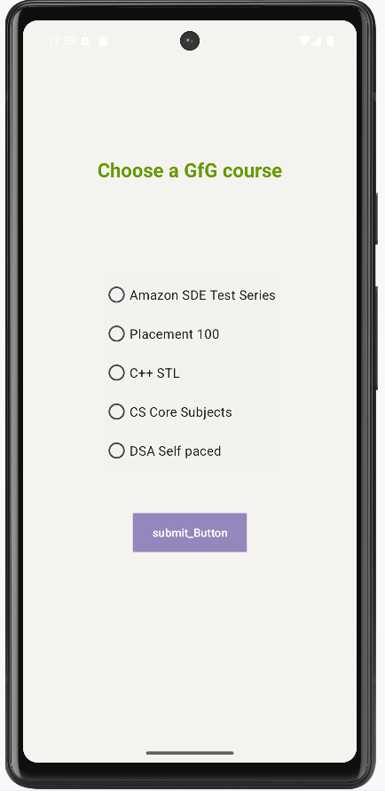
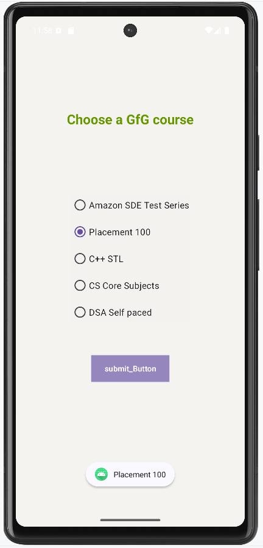

## RadioGroup in Kotlin
RadioGroup class of Kotlin programming language is used to create a container which holds multiple RadioButtons. The RadioGroup class is beneficial for placing a set of radio buttons inside it because this class adds multiple-exclusion scope feature to the radio buttons. This feature assures that the user will be able to check only one of the radio buttons among all which belongs to a RadioGroup class. If the user checks another radio button, the RadioGroup class unchecks the previously checked radio button. This feature is very important when the developer wants to have only one answer to be selected such as asking the gender of a user.

# The class hierarchy of the RadioGroup class in Kotlin
```
kotlin.Any
  ↳android.view.View
     ↳ android.view.ViewGroup
          ↳ android.widget.LinearLayout 
               ↳ android.widget.RadioGroup
```
# XML attributes of RadioGroup widget
| Attribute                  | Description |
|---------------------------|-------------|
| `android:id`              | To uniquely identify the RadioGroup |
| `android:background`      | To set a background colour |
| `android:onClick`         | A method to perform a certain action when RadioGroup is clicked |
| `android:onClick`         | Name of the method to invoke when a RadioButton is clicked |
| `android:visibility`      | Used to control the visibility (visible, invisible, gone) |
| `android:layout_width`    | To set the width |
| `android:layout_height`   | To set the height |
| `android:contentDescription` | To give a brief description of the view |
| `android:checkedButton`   | Stores the ID of the child RadioButton that needs to be checked by default |
| `android:orientation`     | To set the orientation (horizontal or vertical) |

## Step by Step Implementation of RadioGroup
# Step 1: Create new project
<ul>
<li>Click on File, then New => New Project.</li>
<li>Choose "Empty Activity" for the project template.</li>
<li>Select language as Kotlin.</li>
<li>Select the minimum SDK (According to the application needs).</li>
</ul>

# Step 2: Open activity_main.xml file
Below is the code for activity_main.xml file to add a RadioGroup and its 5 RadioButton children. A normal submit button is also added to accept and display the response selected by the user.
# activity_main.xml:
```xml
<?xml version="1.0" encoding="utf-8"?>
<androidx.constraintlayout.widget.ConstraintLayout
    xmlns:android="http://schemas.android.com/apk/res/android"
    xmlns:app="http://schemas.android.com/apk/res-auto"
    xmlns:tools="http://schemas.android.com/tools"
    android:layout_width="match_parent"
    android:layout_height="match_parent"
    android:background="#168BC34A"
    tools:context=".MainActivity">

    <TextView
        android:id="@+id/textView"
        android:layout_width="wrap_content"
        android:layout_height="wrap_content"
        android:text="Choose a GfG course"
        android:textAlignment="center"
        android:textColor="@android:color/holo_green_dark"
        android:textSize="24sp"
        android:textStyle="bold"
        app:layout_constraintBottom_toBottomOf="parent"
        app:layout_constraintEnd_toEndOf="parent"
        app:layout_constraintStart_toStartOf="parent"
        app:layout_constraintTop_toTopOf="parent"
        app:layout_constraintVertical_bias="0.19" />

    <RadioGroup
        android:id="@+id/radioGroup1"
        android:layout_width="wrap_content"
        android:layout_height="wrap_content"
        android:background="#024CAF50"
        app:layout_constraintBottom_toBottomOf="parent"
        app:layout_constraintEnd_toEndOf="parent"
        app:layout_constraintStart_toStartOf="parent"
        app:layout_constraintTop_toBottomOf="@+id/textView"
        app:layout_constraintVertical_bias="0.24000001">

        <RadioButton
            android:id="@+id/radioButton1"
            android:layout_width="match_parent"
            android:layout_height="wrap_content"
            android:text="Amazon SDE Test Series"
            android:textSize="16sp" />

        <RadioButton
            android:id="@+id/radioButton2"
            android:layout_width="match_parent"
            android:layout_height="wrap_content"
            android:text="Placement 100"
            android:textSize="16sp" />

        <RadioButton
            android:id="@+id/radioButton3"
            android:layout_width="match_parent"
            android:layout_height="wrap_content"
            android:text="C++ STL"
            android:textSize="16sp" />

        <RadioButton
            android:id="@+id/radioButton4"
            android:layout_width="match_parent"
            android:layout_height="wrap_content"
            android:text="CS Core Subjects"
            android:textSize="16sp" />

        <RadioButton
            android:id="@+id/radioButton5"
            android:layout_width="match_parent"
            android:layout_height="wrap_content"
            android:text="DSA Self paced"
            android:textSize="16sp" />
    </RadioGroup>

    <Button
        android:id="@+id/submitButton"
        android:layout_width="wrap_content"
        android:layout_height="wrap_content"
        android:background="#AB4CAF50"
        android:text="submit_Button"
        app:layout_constraintBottom_toBottomOf="parent"
        app:layout_constraintEnd_toEndOf="parent"
        app:layout_constraintStart_toStartOf="parent"
        app:layout_constraintTop_toBottomOf="@+id/radioGroup1"
        app:layout_constraintVertical_bias="0.17000002" />

</androidx.constraintlayout.widget.ConstraintLayout>
```
# Step 3: Open MainActivity.kt file
Below is the code for MainActivity.kt file to access RadioGroup widget in kotlin file and show a proper message whenever a radio button is selected by the user.
# MainActivity.kt:
```kt
package com.gfg.radiogroup

import androidx.appcompat.app.AppCompatActivity
import android.os.Bundle
import android.view.View
import android.widget.Button
import android.widget.RadioButton
import android.widget.RadioGroup
import android.widget.Toast

class MainActivity : AppCompatActivity() {
    lateinit var radioGroup: RadioGroup
    lateinit var radioButton: RadioButton
    private lateinit var button: Button

    override fun onCreate(savedInstanceState: Bundle?) {
        super.onCreate(savedInstanceState)
        setContentView(R.layout.activity_main)

        // Display name of the Application
        title = "RadioGroup in Kotlin"

        // Assigning id of RadioGroup
        radioGroup = findViewById(R.id.radioGroup1)

        // Assigning id of Submit button
        button = findViewById(R.id.submitButton)

        // Actions to be performed
        // when Submit button is clicked
        button.setOnClickListener {

            // Getting the checked radio button id
            // from the radio group
            val selectedOption: Int = radioGroup!!.checkedRadioButtonId

            // Assigning id of the checked radio button
            radioButton = findViewById(selectedOption)

            // Displaying text of the checked radio button in the form of toast
            Toast.makeText(baseContext, radioButton.text, Toast.LENGTH_SHORT).show()
        }
    }
}
```
# Output

