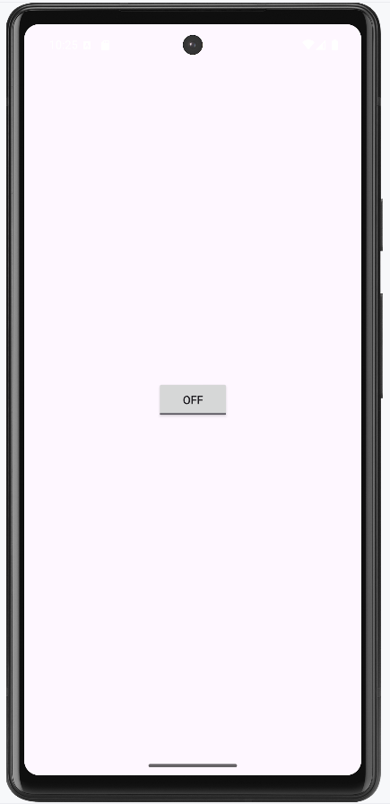
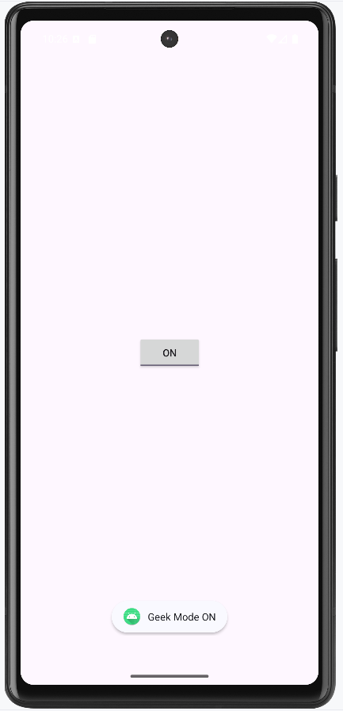

# ToggleButton Sample App (Kotlin)

A simple Android application demonstrating the use of **ToggleButton** in Kotlin. The ToggleButton allows the user to switch between **ON** and **OFF** states and perform actions based on the state.

---

## Features

- Simple **ToggleButton** with ON/OFF states.
- Displays a **Toast message** when the button state changes.
- Uses Kotlin and AndroidX ConstraintLayout.

---
# ToggleButton Attributes

| Attribute             | Description                                         |
|-----------------------|-----------------------------------------------------|
| `android:id`          | The ID assigned to the ToggleButton               |
| `android:textOff`     | The text shown on the button when it is not checked |
| `android:textOn`      | The text shown on the button when it is checked    |
| `android:disabledAlpha` | The alpha (opacity) to apply when disabled      |

## Steps to Demonstrate Implementation ToggleButton
Follow is the steps mentioned below to check on the application implementing ToggleButton in it.

## Step 1: Create a new project in Android Studio
To create a new project in Android Studio follow these steps:
<ul>
<li>Click on File, then New, and then New Project, and give a name whatever you like.</li>
<li>Choose “Empty Activity” for the project template.</li>
<li>Then, select Kotlin language Support and click the next button.</li>
<li>Select minimum SDK(According to the application need).</li>
</ul>

## XML Layout (`activity_main.xml`)

```xml
<?xml version="1.0" encoding="utf-8"?>
<androidx.constraintlayout.widget.ConstraintLayout 
    xmlns:android="http://schemas.android.com/apk/res/android"
    xmlns:app="http://schemas.android.com/apk/res-auto"
    xmlns:tools="http://schemas.android.com/tools"
    android:layout_width="match_parent"
    android:layout_height="match_parent"
    tools:context=".MainActivity">

    <ToggleButton
        android:id="@+id/toggleButton"
        android:layout_width="wrap_content"
        android:layout_height="wrap_content"
        app:layout_constraintBottom_toBottomOf="parent"
        app:layout_constraintEnd_toEndOf="parent"
        app:layout_constraintStart_toStartOf="parent"
        app:layout_constraintTop_toTopOf="parent"
        android:textOn="ON"
        android:textOff="OFF" />

</androidx.constraintlayout.widget.ConstraintLayout>
```

## Step 2: Accessing the Toggle Button
The toggle button in the layout can be accessed using the findViewById() function.

```
val toggle: ToggleButton = findViewById(R.id.toggleButton)
```

After accessing set a listener to perform actions based on the toggle state using setOnCheckedChangeListener() method.
```
toggle.setOnCheckedChangeListener { _, isChecked -> **Perform Any Action Here**}
```

# MainActivity.kt:

```kt
package com.example.togglebuttonsample
import androidx.appcompat.app.AppCompatActivity
import android.os.Bundle
import android.widget.Toast
import android.widget.ToggleButton

// Main Activity 
class MainActivity : AppCompatActivity() 
{
  	// onCreate function
    override fun onCreate(savedInstanceState: Bundle?) 
  	{
        super.onCreate(savedInstanceState)
        setContentView(R.layout.activity_main)

        // Toggle Button
        val toggle: ToggleButton = findViewById(R.id.toggleButton)
        
        // Clicking the Toggle Button
        toggle.setOnCheckedChangeListener { _ , isChecked ->
            Toast.makeText(this, if(isChecked) "Geek Mode ON" else "Geek Mode OFF"
                           , Toast.LENGTH_SHORT).show()
        }
    }
}
```
## ScreenShot


